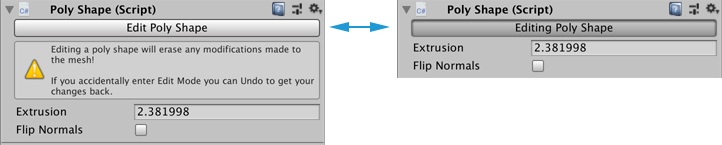

#  Poly Shape component

After you initially [create a Poly Shape](workflow-create-polyshape.md), you can still modify the shape as long as you are in Poly Shape editing mode. You can toggle the Poly Shape editing mode on and off with the **Edit(ing) Poly Shape** button.

> **Note:** You can modify Mesh elements on the Poly Shape Mesh with the standard ProBuilder editing tools. However, each time you re-enter Poly Shape editing mode, you lose any element changes.

## Editing a Poly Shape

When you are in Poly Shape editing mode, the **Poly Shape** component in the Inspector displays the **Editing Poly Shape** button. If you are not in Poly Shape editing mode, the **Edit Poly Shape** button appears instead.

To enter the Poly Shape editing mode, click the **Edit Poly Shape** button. To exit out of the Poly Shape editing mode, click the button (**Editing Poly Shape**) again.

To modify the shape in Poly Shape editing mode, perform the following tasks in the Scene view:

- Click and drag existing control points to move them around.
- Click existing control points to select them, then use **Backspace** (Windows) or **Delete** (macOS) to remove the points from the shape.
- Click along the perimeter line to add new control points.
- Click and drag the handle in the center of the Mesh to set the height.

You can also use the controls in the **Poly Shape** component in the Inspector to:

- Enter a value to use for the height of the Mesh in the **Extrusion** property.
- Enable or disable the **Flip Normals** option to toggle whether the Camera displays the interior or exterior of the Mesh.

