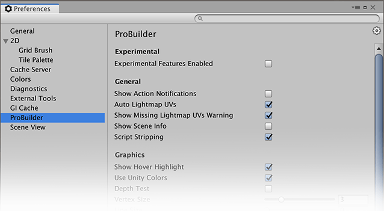

---

ProBuilder contains many settings that can be customized to suit your needs.

## Experimental
> **By enabling these, you’ll have early access to features that are still under development. That means you’ll experience a less stable ProBuilder, so please use with caution. Additionally, we cannot guarantee when or if these experimental features will be completed.**

|**Setting:** ||**Description:**|
|:---|:---|:---|
|**Experimental Features Enabled** || Enables features that are not fully tested.|
|**Store Mesh as Asset**|| 	ProBuilder will store mesh information in the Project instead of per-scene.|

## General

|**Setting:** ||**Description:**|
|:---|:---|:---|
|**Show Action Notifications** ||This preference enables or disables notification popups when performing actions. |
|**Auto Lightmap UVs** || Automatically generate UV2 when neccessary.|
|**Show Missing Lightmap UVs Warning** || Show a warning log if lightmaps are baked while ProBuilder shapes are missing a valid UV2 channel.|
|**Show Scene Info**||Show information about the selected meshes in the Scene View.|
|**Script Stripping**||Strip all ProBuilder scripts when building executable.|

## Graphics

|**Setting:** ||**Description:**|
|:---|:---|:---|
|**Handle Z Test**||Are Vertex, Edge, and Face handles rendered through geometry?|
|**Show Hover Highlight**||Highlight elements when hovering over them|
|**Use Unity Colors**||Disable this to set your own element selection and hover colors|
|**Vertex Size**||Size of vertex handles|
|**Line Size**||Size of edge element lines|
|**Wireframe Size**||Size of wireframe lines|

## Mesh Editing

|**Setting:** ||**Description:**|
|:---|:---|:---|
|**Auto Resize Colliders**||Automatically resize colliders according to mesh bounds as you edit|
|**Allow non-manifold actions**||Allow un-restricted mesh editing, may create non-manifold geometry |

## Mesh Settings

|**Setting:** ||**Description:**|
|:---|:---|:---|
|**Static Editor Flags**||Set the default static flags for new ProBuilder objects|
|**Material**||Set the default material for new ProBuilder objects|
|**Mesh Collider is COnvex**||Set the default convex collider state for new ProBuilder objects|
|**Pivot Location**||Set the default pivot location for new ProBuilder objects|
|**Snap New Shape to Grid**||When spawning a new ProBuilder object, snap it to the Grid (if ProGrids is installed and active)|
|**Shadow Casting Mode**||Set the default shadow casting mode for new ProBuilder objects|
|**Collider Type**||Set the default collider type for new ProBuilder objects|
|**Lightmap UVs Settings**||Set the default lightmapping parameters for new ProBuilder objects|

## Shortcuts

|**Setting:** ||**Description:**|
|:---|:---|:---|
|**(Various Shortcuts)**||Set shortcut keys and modifiers for compatible actions|

## Toolbar

|**Setting:** ||**Description:**|
|:---|:---|:---|
|**Shift Key Tooltips**||Only show ProBuilder tooltips on hover if holding SHIFT|
|**Icon GUI**||Show the Icon Mode GUI, instead of text|
|**Unique Mode Shortcuts**||Enable shortcuts to select element modes (Object, Vertex, Edge, Face)|
|**Toolbar Location**||Where in the Scene View is the Edit Mode Toolbar shown?|
|**Close Shape Window after Build**||Automatically close the Shape Window when the Build button is clicked|

## UV Editor

|**Setting:** ||**Description:**|
|:---|:---|:---|
|**Grid Size**||Size of the Grid in the UV editor, for visual and functional purposes|