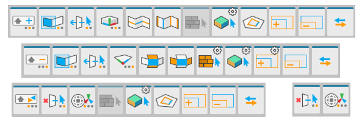

# Selection tools

This portion of the ProBuilder toolbar provides access to selection modifiers and tools.

Depending on whether you have the [Toolbar display mode](toolbar.md#buttonmode) set to **text** mode or **icon** mode, the selection tool button displays the following to indicate what state the tool is in:

* In **text** mode, the button displays the label text followed by a colon and the name of the state. For example, the [Select Hidden](Selection_SelectHidden.md) tool displays either **Select Hidden: On** or **Select Hidden: Off**.
* In **icon** mode, the icon displays a visual cue that reveals the tool's current state. For example, the [Orientation](HandleAlign.md) tool uses these three icons to indicate the handle alignment states:  (*Local*),  (*Global*), and  (*Normal*).

The documentation for each tool includes information about these visual indicators.

> **Note:** Some actions also have extra options or custom settings available. These tool buttons have a special indicator in the top-right corner. The documentation for each tool includes information about these options.

##  Shift

Use the **Shift** tool to define how holding the **Shift** key affects selection.

For more information, see the [Shift](Selection_Shift.md) tool documentation.

##  Rect

Use the **Rect** tool to define whether drag selection should only select elements inside the drag-rect, or any intersected elements.

For more information, see the [Rect](Selection_Rect_Intersect.md) tool documentation.

##  Select Hidden

Use the **Select Hidden** tool to define whether hidden elements are selected or ignored when drag-selecting.  

For more information, see the [Select Hidden](Selection_SelectHidden.md) tool documentation.

##  Select Edge Loop

Use the **Select Edge Loop** tool to select an edge loop from each selected edge.

For more information, see the [Select Edge Loop](Selection_Loop_Edge.md) tool documentation.

##  Select Edge Ring

Use the **Select Edge Ring** tool to select a ring from each selected edge.

For more information, see the [Select Edge Ring](Selection_Ring_Edge.md) tool documentation.

##  Select Face Loop

Use the **Select Face Loop** tool to select a face loop from each selected face.

For more information, see the [Select Face Loop](Selection_Loop_Face.md) tool documentation.

##  Select Face Ring

Use the **Select Face Ring** tool to select a face ring from each selected face.

For more information, see the [Select Face Ring](Selection_Ring_Face.md) tool documentation.

##  Select by Material

Use the **Select by Material** tool to select all faces which have the same Material. 

For more information, see the [Select by Material](Selection_SelectByMaterial.md) tool documentation.

##  Select by Colors

Use the **Select by Colors** tool to select all faces on this object which have the same vertex color. 

For more information, see the [Select by Colors](Selection_SelectByVertexColor) tool documentation.

##  Select Holes

Use the **Select Holes** tool to select all elements along the selected open vertex or edge.

For more information, see the [Select Holes](Selection_SelectHole.md) tool documentation.

##  Grow Selection

Use the **Grow Selection** tool to expand the selection outward to adjacent faces, edges, or vertices.

For more information, see the [Grow Selection](Selection_Grow.md) tool documentation.

##  Shrink Selection

Use the **Shrink Selection** tool to remove the elements on the perimeter of the current selection ([Grow Selection](Selection_Grow.md) in reverse).

For more information, see the [Shrink Selection](Selection_Shrink.md) tool documentation.

##  Invert Selection

Use the **Invert Selection** tool to select the inverse of the current selection.

For more information, see the [Invert Selection](Selection_Invert.md) tool documentation.

