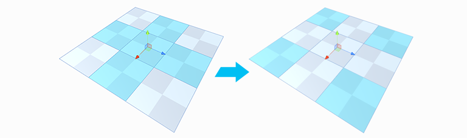
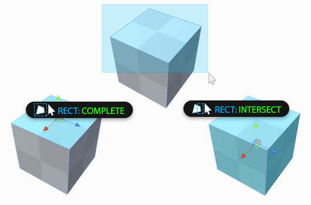

---

##  Select Hidden

Section Video: <a href="https://youtu.be/le7AchazndE?list=PLrJfHfcFkLM-b6_N-musBp4MFaEnxpF6y">Selection Tools: Select Hidden</a>

Determines whether hidden elements are selected or ignored, when drag-selecting. This is a toggle button, click to change modes:

|**Toolbar Icon:** |**Description:** |
|:---|:---|
|  | **On**: all [elements](fundamentals#editing-meshes) are selectable, regardless of their visibility |
|  |  **Off**: drag selection will ignore any [elements](fundamentals#editing-meshes) that cannot currently be seen |

##  Handle Alignment

Section Video: <a href="https://youtu.be/C9sXO4sNhKM?list=PLrJfHfcFkLM-b6_N-musBp4MFaEnxpF6y">Selection Tools: Handle Alignment</a>

**Keyboard Shortcut** : `P`

Choose how the scene handles will be oriented when selecting [elements](fundamentals#editing-meshes). This is a toggle button; click to change modes:

|**Toolbar Icon:** |**Description:** |
|:---|:---|
|  | Global: Similar to a compass, the handle orientation is always the same, regardless of local rotation. |
|  | Local: Similar to "left vs right", handle orientation is relative the object's rotation. |
|  | Normal: This special mode aligns the handles to exact normal direction of the selected face. |

> **TIP:** If you set Unity's "Pivot <> Center" toggle to "Pivot" while also using ProBuilder's "Normal" alignment, you can manipulate elements from the active item, for example hinging a selection of vertices from a specific point! 

##  Grow Selection

Section Video: <a href="https://youtu.be/yX29De1bcUE?list=PLrJfHfcFkLM-b6_N-musBp4MFaEnxpF6y">Selection Tools: Grow Selection</a>

**Keyboard Shortcut**: `ALT G`

Expands the selection outward to adjacent faces, edges, or vertices.

 **Options**:

Setting | Description
--- | ---
**Restrict To Angle** | Only Grow Selection to faces within a specified angle
**Max Angle** | The angle to use when Restrict to Angle is **On**
**Iterative** | Only Grow Selection to adjacent faces, with each button press

##  Shrink Selection

Section Video: <a href="https://youtu.be/1z2sDcHF69o?list=PLrJfHfcFkLM-b6_N-musBp4MFaEnxpF6y">Selection Tools: Shrink Selection</a>

**Keyboard Shortcut** : `ALT SHIFT G`

Does the opposite of Grow Selection: removes the elements on the perimeter of the current selection.

##  Invert Selection

Section Video: <a href="https://youtu.be/Dj9qHeCIZwY?list=PLrJfHfcFkLM-b6_N-musBp4MFaEnxpF6y">Selection Tools: Invert Selection</a>

**Keyboard Shortcut** : `CTRL SHIFT I`

Selects the inverse of the current selection. All unselected elements will become selected, the current selection will be unselected.

##  Select Edge Loop

Section Video: <a href="https://youtu.be/gh_cV_lkI6s?list=PLrJfHfcFkLM-b6_N-musBp4MFaEnxpF6y">Selection Tools: Select Edge Loop</a>

**Keyboard Shortcut** : `ALT L`

Selects an edge loop from each selected edge.

##  Select Edge Ring

Section Video: <a href="https://youtu.be/sVZgWycaZ4M?list=PLrJfHfcFkLM-b6_N-musBp4MFaEnxpF6y">Selection Tools: Select Edge Ring</a>

**Keyboard Shortcut** : `ALT R`

Selects a ring from each selected edge.

##  Select Face Loop

<!-- 

Section Video: <a href="https://youtu.be/gh_cV_lkI6s?list=PLrJfHfcFkLM-b6_N-musBp4MFaEnxpF6y">Selection Tools: Select Face Loop</a>

 -->
**Keyboard Shortcut** : `ALT L` `Shift + Double Click`

Selects a face loop from each selected face. Faces are only considered to be part of a loop if they contain exactly 4 sides.

##  Select Face Ring

<!-- 

Section Video: <a href="https://youtu.be/sVZgWycaZ4M?list=PLrJfHfcFkLM-b6_N-musBp4MFaEnxpF6y">Selection Tools: Select Face Ring</a>

 -->

**Keyboard Shortcut** : `ALT R` `Control + Double Click`

Selects a face ring from each selected face. Faces are only considered to be part of a ring if they contain exactly 4 sides.

##  Select Hole

Section Video: <a href="https://www.youtube.com/watch?v=kqfcaxmRT-8&index=6&list=PL1GU9r7hfosDHqJBqsBzkrLRDOH2EXCMa">Selection Tools: Select Hole</a>

With an open vertex or edge selected, click **Select Hole** to select all elements along opening.

With no elements selected, clicking **Select Hole** will automatically select **all** holes in the selected object.

##  Select by Material

Section Video: <a href="https://www.youtube.com/watch?v=OAyQ-hf45NA&index=2&list=PL1GU9r7hfosDHqJBqsBzkrLRDOH2EXCMa">Selection Tools: Select byMaterial</a>

Click to select all faces on this object, which use the same material as the selected face.

##  Select by Vertex Color

Section Video: <a href="https://www.youtube.com/watch?v=_LxVLz8AbMg&index=1&list=PL1GU9r7hfosDHqJBqsBzkrLRDOH2EXCMa">Selection Tools: Select by Vertex Color</a>

Click to select all faces on this object, which have the same vertex color as the selected face.

##  Shift Modifier

Section Video: <a href="https://www.youtube.com/watch?v=2bOdeAZ3EJU&index=5&list=PL1GU9r7hfosDHqJBqsBzkrLRDOH2EXCMa">Selection Tools: Shift Modifier</a>

Choose how holding the SHIFT key will affect selection, when clicking or drag-selecting:

|**Toolbar Icon**: |**Description:** |
|:---|:---|
|  |Add: always add to the selection |
|  |Subtract: always subtract from the selection |
|  |Difference: unselected elements are added, selected elements are subtracted |

##  Selection Rect Mode

Choose whether drag selection should only select elements inside the drag-rect (Complete), or also elements intersected by the drag-rect.

|**Toolbar Icon**: |**Description:** |
|:---|:---|
|  |Complete: Only select elements entirely within the drag-rect |
|  |Intersect: Select both occluded and intersected elements |

