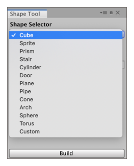
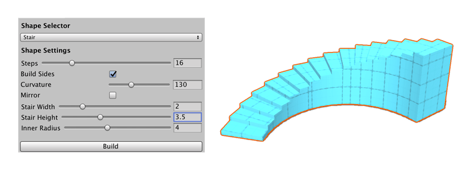

#  Shape Tool window

Use the **Shape Tool** window to create new ProBuilder Mesh shapes such as cylinders, arches, and stairs.

 

Each shape has specific properties which you can customize before adding to your Scene. For example, the *Stair* shape lets you choose items like step height, arc, and which parts of the stairway to build.

ProBuilder Mesh shapes are similar to other GameObjects in Unity in terms of how they interact with other GameObjects and respond to Physics in the Scene. However, you can customize and deform ProBuilder Meshes after you create them using [ProBuilder's editing tools](workflow-edit). 

## Creating specific shapes

To create a new ProBuilder Mesh based on one of the predefined shapes:

1. Click the **New Shape** tool from the ProBuilder toolbar. 

	> ***Tip:*** You can also use the **Ctrl+Shift+K** (Windows) or **Cmd+Shift+K** (Mac) hotkey to open the **Shape Tool** window or from the menu (**Tools** > **ProBuilder** > **Editors** > **Open Shape Editor Menu Item**).

1. Choose the shape you'd like to create (*Cube*, *Cylinder*, *Torus*, etc) from the __Shape Selector__ drop-down menu. The properties specific to that shape type apppear in the Shape Tool window.

1. Set the options (width, height, radius, number of stairs) according to the type of shape.

1. You may move or rotate the preview object within the Scene view.

1. Click **Build** to create the new Mesh. 

	Now that you have a ProBuilder Mesh, you can use [ProBuilder's editing tools](workflow-edit) to further define the Mesh.

## Shape-specific properties

The following sections describe the shape-specific properties available for these shape types:

* [Cube](Cube.md)
* [Sprite](Sprite.md)
* [Prism](Prism.md)
* [Stair](Stair.md)
* [Cylinder](Cylinder.md)
* [Door](Door.md)
* [Plane](Plane.md)
* [Pipe](Pipe.md)
* [Cone](Cone.md)
* [Arch](Arch.md)
* [Sphere](Sphere.md)
* [Torus](Torus.md)
* [Custom](Custom.md)

