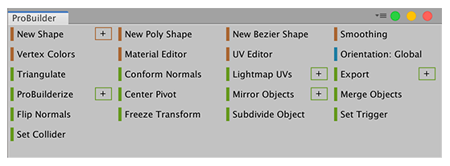
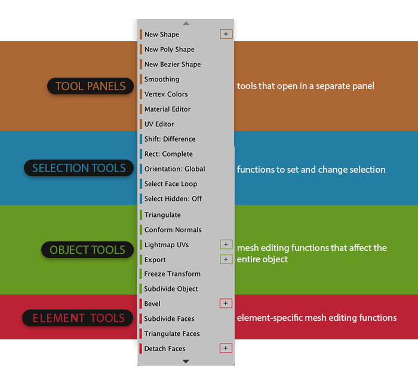
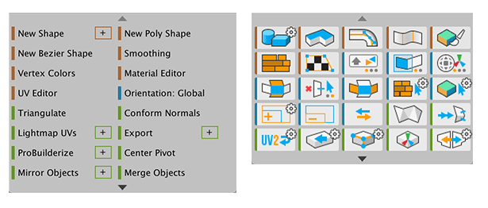
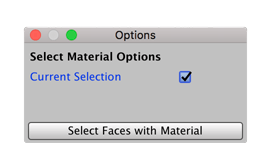

# The ProBuilder toolbar

You can open the **ProBuilder** toolbar from Unity’s top menu: __Tools__ > __ProBuilder__ > __ProBuilder Window__. 

When you open the main **ProBuilder** toolbar, the [Edit mode toolbar](edit-mode-toolbar.md) also opens in the active Scene view, where you can see and change the [current editing mode](modes.md).

Use this toolbar to access Editor windows, as well as selection, creation, and editing tools for Meshes. 

## Tool categories

The ProBuilder toolbar is color-coded to help you quickly choose tools by type:

* **Orange** for [tool panels (windows)](tool-panels.md)
* **Blue** for [selection tools](selection-tools.md)
* **Green** for [Object actions](object-actions.md)
* **Red** for Element actions (on [Vertex](vertex.md), [Edge](edge.md), and [Face](face.md) geometry)

### Dynamic layout

The ProBuilder window dynamically changes to match your current edit mode and element selection:

* Buttons only appear if you can use them with your [current edit mode](modes.md).
* Buttons are disabled if you cannot use them on the current selection.

### Toolbar display modes

The ProBuilder toolbar displays buttons as either text or icons.

> **Tip:** By default, the toolbar appears in Text mode, but you can change switch to Icon mode instead. You can also resize the toolbar and switch between making it floating and dockable. See [Customizing ProBuilder](customizing.md#toolbar) for details.

### Options for ProBuilder tools

Some actions (such as [Extrude](Face_Extrude.md), [Collapse](Vert_Collapse.md), and [Grow Selection](Selection_Grow.md)) also have extra options or custom settings, which can change how ProBuilder performs the action by default. If there are options available for a tool, an indicator appears in the top-right corner of that tool's button which allows you to access the **Options** window:

* In **Icon Mode**, the gear  indicator appears next to a tool button if there are options available. To open the **Options** window, **Alt+Click** anywhere on the tool button.
* In **Text Mode**, the `+` icon appears on the right side of a tool button if there are options available. To open the **Options** window, click on the tool button's `+` icon.

> ***Caution:*** When you change one of these options, those changes become the default settings for that tool in the Scene until you change them again.

For example, the [Select by Material](Selection_SelectByMaterial.md) tool allows you to specify whether ProBuilder limits the new selection to match only faces on the currently selected object or faces on any object in the Scene. 

> **Note:** The documentation for each tool includes information about any options.

