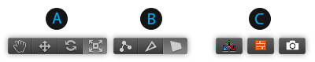

# UV Editor toolbar

 This first group of buttons contains shortcuts to the standard Unity manipulation modes. Clicking these has the exact same effect as clicking on the [main Unity toolbar buttons](https://docs.unity3d.com/Manual/PositioningGameObjects.html).

 The second button group contains shortcuts to ProBuilder's [Element Edit modes](edit-mode-toolbar.md). When using [Manual UV Editing](manual-uvs-actions.md), this allows you to select and manipulate UVs by Vertex, Edge, or Face.  

> ***Note:*** When using [Auto UVs](auto-uvs-actions.md) you may only edit UVs by face. Editing an Edge or Vertex will convert the selected UVs to [Manual UVs](manual-uvs-actions.md).

 The third group of buttons allow you to: 

* Control how Unity's standard [transform tools](#Scope) behave.
* Display the face's [Texture](#Texture) in the UV Viewer (or not).
* Create [UV Templates](#SaveUV) from the current UV mapping.

##  Scope controls

When **On** (), you can use Unity's standard Move, Rotate, and Scale tools to directly manipulate UVs in the scene, without affecting geometry.

When **Off** (), the Move, Rotate, and Scale tools return to normal geometry actions.

When using the transform tools in the UV Viewer, you can snap to increments with the **Ctrl** (Windows) or **Cmd** (Mac) modifiers. You can customize the size of these increment values by setting the [UV Snap Increment](preferences.md#uvs) preference.

##  Texture preview

When **On** (), the selected face's Texture appears in the UV Viewer. This preview makes it easier to fit the UV to the Texture.

When **Off** (), the Texture does not appear in the UV Viewer.

##  Save UV image

Click the Camera icon () to open the **Save UV Image** window. You can use this window to render a UV Template for texture map painting, atlasing, and sprite sheets.

|**Property:** |**Function:** |
|:---|:---|
|__Image Size__|Choose the total size for the rendered template. ProBuilder always renders the image as a square.|
|__Hide Grid__|Enable this option to prevent the grid from appearing in the rendered image.|
|__Line Color__|Choose the color that you want ProBuilder to use for rendering the UV lines.|
|__Transparent Background__|Enable this option to render a transparent background.|
|__Background Color__|Choose the color that you want ProBuilder to use for the background. This option is only available when the __Transparent Background__ property is disabled.|

When you are satisfied with the options on this window, click the __Save UV Template__ button. A file browser opens so you can choose the filename and location where you want to save the file.