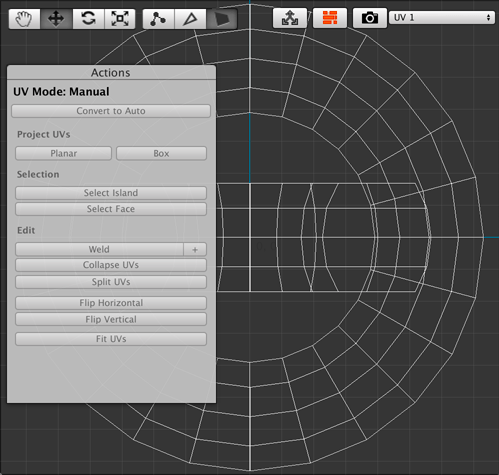
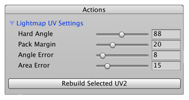

# UV drop-down menu

The UV drop-down menu allows you to switch between [UV1](#uv1) and [UV2](#uv2) modes (UV3 and UV4 are not used at this time). UV1 provides texture-mapping tools and UV2 provides options for generating lightmap UVs.

## UV1

When you select **UV1** from the  UV drop-down menu, the **Actions** panel displays the default UV mapping. 

If you selected the object before opening the UV Editor window, the tools in the Actions panel are disabled. To enable them, choose one of these element Edit modes to edit the UVs:

- Click the [Face Edit Mode button](edit-mode-toolbar.md) and select one or more faces in the UV viewer to edit in either [Auto](auto-uvs-actions.md) or [Manual](manual-uvs-actions.md) UV mode.  
- Click the [Edge Edit Mode button](edit-mode-toolbar.md) and select one or more edges in the UV viewer to begin editing in [Manual](manual-uvs-actions.md) UV mode.
- Click the [Vertex Edit Mode button](edit-mode-toolbar.md) and select one or more vertices in the UV viewer to begin editing in [Manual](manual-uvs-actions.md) UV mode.

You can switch between the [Auto](auto-uvs-actions.md) and [Manual](manual-uvs-actions.md) UV modes by clicking the **Convert to Manual** or **Convert to Auto** button at the top of the **Actions** panel. Both modes provide their own options in the Actions panel.

> ***Note:*** When using [Auto UVs](auto-uvs-actions) you may only edit UVs by face. Editing an edge or vertex automatically converts the selected UVs to [Manual UVs](manual-uvs-actions).

## UV2 (read-only)

When you select **UV2 (read-only)** from the UV drop-down menu, the **Actions** panel displays the [Lightmap UV Settings](https://docs.unity3d.com/Manual/LightingGiUvs-GeneratingLightmappingUVs.html) and the **Rebuild Selected UV2** button.

You can set up the options generating lightmap UVs for the selected UV2s and then click the **Rebuild Selected UV2** button when you are finished. 

> ***Note:*** This only affects the UV2s that are currently selected. If you want to rebuild the UV2s for the entire scene, use the [Lightmap UVs tool](Object_LightmapUVs.md) instead.

## UV3 (read-only)

Not used.

## UV4 (read-only)

Not used.