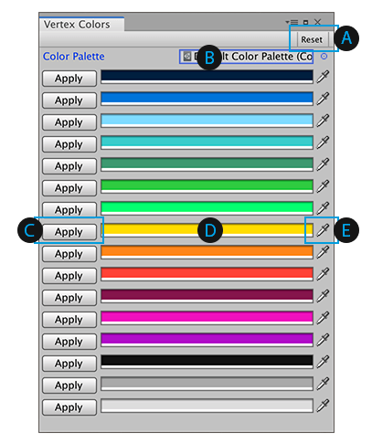

#  Vertex Colors window

Use the **Vertex Colors** window to [apply vertex colors](#apply) onto an entire Mesh or only a portion.

To open this window, click the **Vertex Colors** button (  ) from the [ProBuilder toolbar](toolbar.md).

> **Tip:** You can also access this tool from the ProBuilder menu (**Tools** > **ProBuilder** > **Editors** > **Open Vertex Color Editor**).

 Click the **Reset** button to return all the colors on the **Color Palette** to their default values.

 You can import your [own swatch library](https://docs.unity3d.com/Manual/PresetLibraries.html) and use its colors instead of the default Unity colors. To do this, set a reference to the swatch library file.

 Click the **Apply** button to [set the associated color](workflow-vertexcolors.md#apply) on the selected object(s) or element(s).

 Use the [standard Unity Color Picker](https://docs.unity3d.com/Manual/EditingValueProperties.html) to pick a custom color for the palette.

 Use the eyedropper tool to match a custom color exactly for the palette.
