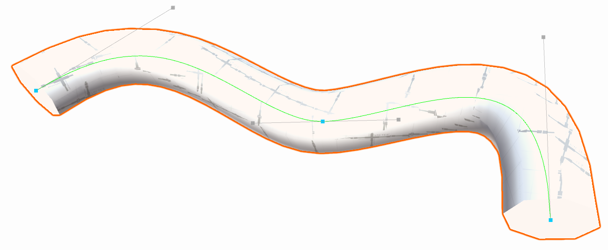

# Creating a Mesh with the Bezier Shape tool

The Bezier Shape tool uses a Bezier spline (curve) and extrudes along it to create a 3D version of the curve. You fine-tune the shape by using the tangent handles on the control points to bend the shape.

To create a Mesh based on a bezier (curve) shape, select  **New Bezier Shape** from the [ProBuilder toolbar](toolbar.md). The initial curve has two control points with tangent handles to control the curve's bend. By default, ProBuilder creates the curve [in editing mode](bezier.md) so you can continue to reshape it.

> **Tip:** You can access this tool from the ProBuilder menu (**Tools** > **ProBuilder** > **Editors** > **New Bezier Shape**).
