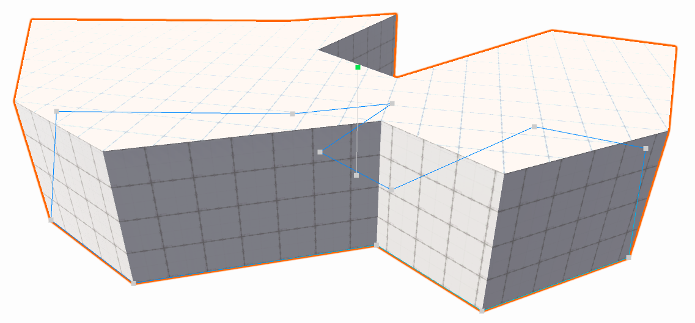
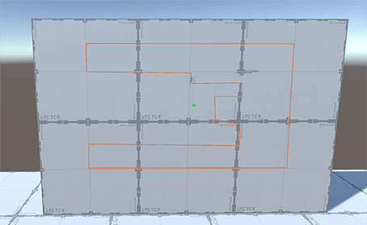
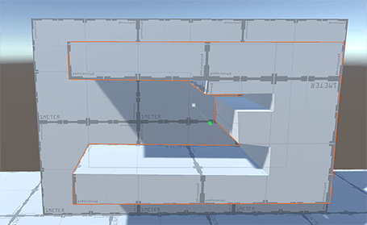
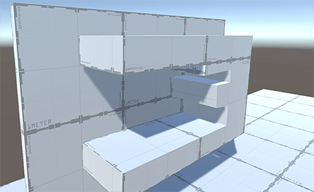

# Creating a Mesh with the Polygon Shape tool

A **Poly Shape** is unlike the [predefined ProBuilder shapes](shape-tool.md), in that it is interactive and you can edit it indefinitely. This is because you can continue to edit the control points and other settings after you create a **Poly Shape**.  

> **Important**: When you modify control points or settings, you lose any changes you made in editing the Mesh.

To create a custom 3-dimensional Mesh, you can use the [Poly Shape tool](polyshape.md) to create a custom 2-dimensional shape, and then extrude that shape to make it 3D. 

To define a custom Mesh:

1. Open the ProBuilder window (in Unity's top menu: **Tools** > **ProBuilder window**).

  The [Edit Mode toolbar](edit-mode-toolbar.md) and the [ProBuilder toolbar](toolbar.md) appear.

2. From the ProBuilder toolbar, click **New Poly Shape** (). 

  > **Tip:** You can also access this tool from the ProBuilder menu (**Tools** > **ProBuilder** > **Editors** > **New Poly Shape**).

3. Click in the Scene view to create control points. Control points form the outer bounds of your Mesh.

	You can click directly on another surface to create an outgrowth, even when that surface is on the y-axis. 

	

4. When you finish placing points, use either **Enter** (Windows), **Return** (macOS), or **Spacebar** to finalize the shape.

	

5. Move the mouse up and down to set the Mesh height. This extrudes a 3D Mesh from the 2D shape you defined with your control points.

6. Click to exit out of create mode. Your new Mesh is now [in editing mode](polyshape.md) so you can continue to modify it.

	

