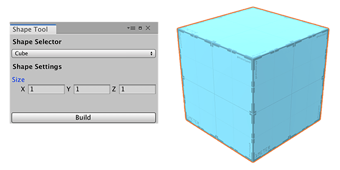

# Creating a pre-defined ProBuilder shape

To create a Mesh from a predefined shape:  

1. Open the ProBuilder window (in Unity's top menu: **Tools** > **ProBuilder window**).

  The [Edit Mode toolbar](overview-ui.md#edit-mode-toolbar) and the [ProBuilder toolbar](toolbar.md) appear.

2. From the ProBuilder toolbar, **Alt/Opt+click** the **New Shape** () button. 

  The [Shape Tool window](shape-tool.md) opens with the cube shape selected by default and a preview image appears in the Scene view.

  

  > **Note:** If you only want a basic cube, click **New Shape** () without pressing **Alt** or **Opt** to skip displaying this window. You can also use **Ctrl/Cmd+K** to create the default cube without modifications.

3. Select a predefined shape from the __Shape Selector__ drop-down menu.

4. Set the shape-specific properties to customize your mesh. Each shape has its own set of properties; for example, for a cube, you can define the X, Y, and Z dimensions, but for a cone, you need to set the radius, height, and number of sides. 

  See the [Shape Tool page](shape-tool.md) for a complete list of predefined shapes and their properties.

5. ProBuilder shows a preview of the final shape in turquoise or blue while you are modifying your Mesh properties. You can move and rotate the Mesh preview object.

6. When you are satisfied with the look of your Mesh, click the **Build** button.

	The blue preview changes to the default ProBuilder material to indicate your Mesh is ready to use.

7. Close the Shape Tool window if you do not need to create another Mesh.

Now that you have created a Mesh shape, you can use any of the [ProBuilder editing tools](workflow-edit.md) to fine-tune or customize that shape further. For example, you can build a plain cube Mesh and then use the **Extrude Face** and **Delete Face** tools to create windows and doors to make a house.

