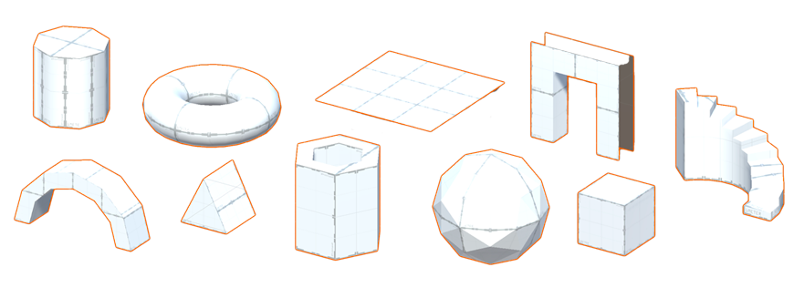

# Creating Meshes

ProBuilder provides several different tools for creating editable Meshes in Unity. 

The most common approach is to [build a predefined shape](workflow-create-predefined.md) with the [Shape Tool](shape-tool.md), which includes a library of shapes. These predefined shapes include standard geometric shapes, as well as some more complex shapes which correspond to objects used in level-building. For example, the **Shape** tool provides simple cubes, prisms, toruses, and other simple geometry which you can use to create buildings, vehicles, and other objects. However, the **Shape** tool also provides some convenient predefined shapes that are typically found in buildings, such as stairs, arches and doors.

 

You can customize each shape by specifying initial dimensions and other shape-specific parameters. For example, you can specify the cube shape’s initial width, height and depth. For the stair shape, you can also set the curvature, the number of steps, and whether to build sides.

> ***Tip:*** **Ctrl+K** is the shortcut for spawning a basic Mesh cube with the default options.

If you need to make a Mesh shaped unlike any of the predefined shapes, you have several options:

- You can use the [Poly Shape tool](polyshape.md) to create a custom 2-dimensional shape and then extrude that shape into a 3-dimensional Mesh. For example, this is a good strategy for quickly building an irregular structure like a medieval church or a star-shaped building.
- You can use the [experimental Bezier tool](bezier.md) to define a bezier curve around which ProBuilder extrudes a Mesh. For example, you can use this tool to create tunnels with lots of twists and turns.
- You can use the [custom Shape tool](Custom.md) to enter a sequence of points (X, Y, Z coordinates) that define whatever Mesh shape you require. The benefit of this approach is that you maintain absolute control over the dimensions of the shape; the drawback is that it can be very difficult to correctly generate the necessary coordinates.
- You can also apply a Boolean operation on two or more Mesh objects to create a new object. You can choose from creating just the difference between the two (Intersection), everything but the difference between the two (Subtraction), or one big Mesh encompassing the two original Meshes plus the space in between them (Union).

Whichever method you use to create your Mesh, you can edit it using any of the [ProBuilder editing tools](workflow-edit.md), [apply vertex colors](workflow-vertexcolors.md), [smooth its sharp edges](workflow-edit-smoothing.md), and [apply Materials and Textures](workflow-materials.md).

