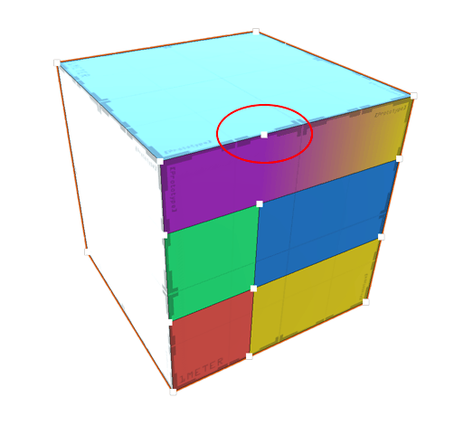

# Modeling tips for novices

To successfully model digital content, you need to balance these two opposing goals:

- The less geometry you use in your Mesh, the faster your game will run. This is because every extra vertex, edge, or face costs more in terms of computing resources.
- The more geometry you use in your Mesh, the more detailed and organic your GameObjects will look. This is because more geometry means smaller polygons, which gives you more control over the shape.

One strategy you can use to try and balance these two goals is to make major modifications, such as [extruding](Face_Extrude.md) and [insetting](Face_Inset.md), until your Mesh is roughly the right shape. During this phase, make sure that your geometry is well-structured: use quads (four-sided polygons) or triangles whenever possible. For example, use [Insert Edge Loop](Edge_InsertLoop.md) instead of [Connect Edges](Edge_Connect.md) to keep the edges and faces as symmetrical as possible.

After you have finished the rough modeling on your Mesh, you can begin to refine it by [subdividing faces](Face_Subdivide.md) as needed. During this phase, you may decide that it is more important achieve the correct shape quickly than to keep perfect uniformity.

Finally, when you are satisfied with the look and shape of your Mesh, you can try to simplify it wherever possible by removing unnecessary geometry. You can [merge faces](Face_Merge.md) to reduce the number of edges Unity has to process, and [collapse](Vert_Collapse.md) or [weld](Vert_Weld.md) extra vertices. You can also [remove any faces](Face_Delete.md) that are hidden behind Meshes or simply beyond the reach of the Camera.

# Ideal geometry

Ideally, when you are working with buildings and other architectural structures, you can use a tool like [ProGrids](https://docs.unity3d.com/Packages/com.unity.progrids@latest) to help you stick to right angles and perfect lines. It also helps you avoid accidentally creating impossible geometry by moving vertices past an adjacent vertex without realizing it.

Avoiding odd angles and using only 90- and 45-degree angles when building makes it easier for you to combine pieces of your buildings together later on. For example, if you build the shell of a house as one Mesh and a staircase as a second Mesh, it is easier to fit the two together if they are aligned perfectly.

# Structures to avoid

Try to avoid creating structures that contain vertices in irregular locations:

- [T-Junctions](#tjoint)
- [Floating vertices](#floatv)

## T-Junctions

If you can avoid vertices at T-junctions, that makes your geometry a lot cleaner:

Notice the edge that splits only the top into two faces and does not continue into the front (the purple face). ProBuilder created the vertices at either end of this edge during a [Connect Edges](Edge_Connect.md) action. 

Using the [Insert Edge Loop](Edge_InsertLoop.md) action instead avoids this complexity by creating edges all the way around the object so there are no T-junctions.

## Floating vertices

Another structure to avoid is a floating (or winged) vertices:

This vertex is only connected to one edge: no other edge connects to it. ProBuilder left it behind after a [Merge Faces](Face_Merge.md) operation. It adds to the complexity of the geometry but is not used, since it does not define any connections.

To fix a floating vertex, select the floating vertex and an adjacent vertex, then run the [Collapse Vertices](Vert_Collapse.md) tool with the **Collapse To First** option enabled. Make sure you select the vertex you want to keep first.

