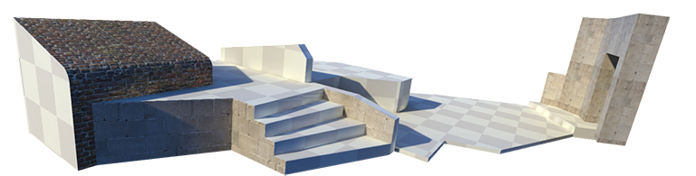
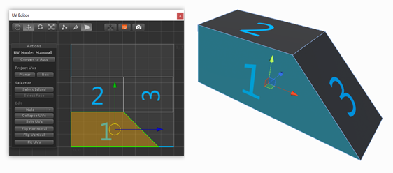
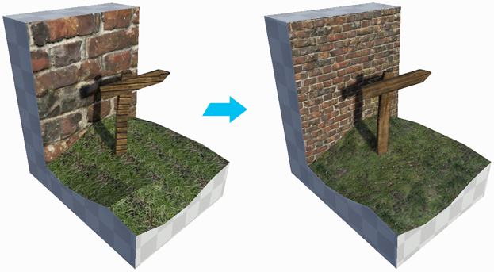

# Materials, Shaders, Textures, and UVs

<!-- @TODO: Settle on the title for this and then do this search to find references to it: 		grep -li '(workflow-texture-mapping' *.md 		
o "Materials, Shaders, Textures, and UVs" (but really nothing about Shaders & smoothing isn't represented)
o "Materials, Textures, and UVs" (but smoothing isn't represented)
Texture Mapping 101 (but non-Texture Materials or smoothing aren't represented)
o "Refining appearances" or "Refining Meshes" or "Refining Mesh appearances" (but that's pretty vague and if you're for quick info on Textures or Materials it's not obvious at the highest TOC level) 
o "Mesh appearance"
o "Finishing Meshes" (same trouble plus) 
o "Materials and Texture wrapping" (similar to what I have now but without the UV)
o Something about Graphics maybe? --> 

In Unity, [Materials](https://docs.unity3d.com/Manual/class-Material.html) allow you to specify which Shader to use on a Mesh. [Shaders](https://docs.unity3d.com/Manual/Shaders.html) perform a set of calculations that tell Unity how to render (draw) your Meshes based on properties specific to that Shader. 

Applying Materials can make your floor look like it's made of tile, wood, stone, or anything else that you want. ProBuilder allows you to [apply a Material](workflow-materials.md) to the entire Mesh or just on selected faces. This allows you to provide more realistic-looking surfaces during game play or while grey-boxing. For example, you can use tiles on the floor, brick on some walls, stone on others, and so on.

Some Materials use [Textures](https://docs.unity3d.com/Manual/Textures.html), which are bitmap images (for example, Unity can import BMP, JPEG, PNG, and most standard 2-dimensional image formats). Unity projects these images on the surfaces of your Mesh to achieve a more realistic result. 

*UVs* are how the Mesh stores the texture mapping data. These are basically 2D fold-outs of the actual 3D Mesh, as if you peeled back the skin of an object and laid it out flat, like the image below.

*UV coordinates* (also sometimes called *texture coordinates*) are references to specific locations on the image using only two dimensions (u,v). Texture mapping is the list of 2D UV coordinates mapped to their 3D vertex counterparts on the surface in three dimensions (x,y,z). This mapping tells Unity exactly how and where to project the image on the Mesh.

> ***Note:*** For more in-depth information on these concepts and the whole relationship between rendering and GameObjects in Unity, see [Materials, Shaders &amp; Textures](https://docs.unity3d.com/Manual/Shaders.html) in the Unity user manual.

The [Smoothing Groups tool](workflow-edit-smoothing.md) smooths the seams on portions of your Meshes and leaves others sharper. This can be very useful when creating organic Meshes, such as terrain objects.

For [Materials containing Textures](workflow-materials.md#texmat), you can use [ProBuilder's texture mapping tools](workflow-texture-mapping.md) to fine-tune the appearance. For example, if you apply a brick Material to a wall, you can adjust the offset, rotation, and tiling of the object's UVs. 

This image shows the Textures before adjustments on the left and after adjustments on the right. The brick Texture on the right was scaled down and tiled on the wall Mesh. The wooden Texture on the right was rotated to match the alignment of the sign post Mesh so that the grain appears to be moving in a natural direction. The grass Texture on the right was repositioned and [smoothed]().

