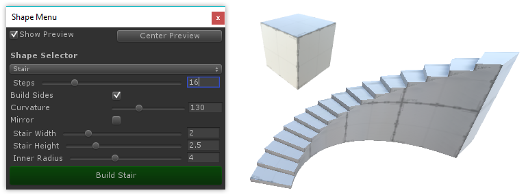

# Fundamentals of ProBuilder

Watch Full Video: <a href="@todo make vid and link to it here">Fundamentals of ProBuilder</a> 

First time using ProBuilder? Start here for an overview of creating your first mesh, editing it's geometry,
applying materials, and UV editing.

---

## Creating a New Mesh

Jump to Video: <a href="@todo link vid section">Fundamentals of ProBuilder: Shape Tool</a> 
More Info: <a href="@todo link to anchor">Shape Tool</a>

 Press "CTRL + K" on your keyboard to spawn in a new, default, ProBuilder-editable cube.

 Press 'CTRL + K' on your keyboard to spawn in a new, default, ProBuilder-editable cube.

To start with a more complex shape, ProBuilder includes a library of shapes (cylinder, torus, stairs, etc), to begin modeling with. Which each of these shapes, you can customize both starting dimensions and unique parameters.

*For full info, see the "[Shape Tool](@todo)" section*

---

## Editing Meshes

Jump to Video: <a href="@todo link vid section">Fundamentals of ProBuilder: Editing Meshes</a>

 

### Object vs Element

ProBuilder is always in one of 2 major modes: **Object** or **Element**.

* **Object Mode** is standard Unity mode, no surprises.
* **Element Mode** activates ProBuilder's mesh editing features. 

**Elements** are the individual parts that make up a mesh: **Vertices**, **Edges**, and **Faces**. If it helps, you can think of these like levels of detail on a map- for example, "city, state, country".

* **Vertex Editing**: Select and edit Vertices for detailed editing and functions like vertex splitting and connecting.
* **Edge Editing**: Select and edit Edges for semi-complex geometry editing, and Edge Loop Modeling techniques.
* **Face Editing**: Select and edit Faces on an object, performing basic tasks like deleting faces and extruding.

### Element Selection and Manipulation

First, choose which Element type you'd like to edit, by clicking it's button in the [Edit Mode Toolbar](@todo).

Then, use any of the standard Unity selection methods (click, drag, etc) and manipulation controls (move, rotate, scale), just as you would on any other object(s).

### Complex Editing Functions

All of ProBuilder's specialized editing functions are available via the [ProBuilder Toolbar](@todo), which dynamically adapts to your Edit Mode and selection.

Each Toolbar button will display detailed information about it's use, options, and keyboard shortcuts, when hovered over. Viewing these is a great way to start learning ProBuilder's deeper functionality.

> *View full list of mesh editing functions: [ProBuilder Toolbar](@todo)*

---

## Materials and Texturing / UV Editing

Jump to Video: <a href="@todo link vid section">Fundamentals of ProBuilder: Materials and Texturing / UV Editing</a>

### Applying Materials

You can apply any material (including Substance, etc) to ProBuilder meshes, using standard "drag-n-drop" method or the [Material Palette](@todo).

Materials can also be applied to individual faces of a ProBuilder mesh, while in [Element Mode](@todo).

> *More Info: [Applying Materials](@todo)*

### Texturing and UVs

ProBuilder includes both "[Auto UVs](@todo)" (default), and a complete [Manual UV Editing and Unwrapping](@todo) system.

**You may use whichever you prefer, or a mix of both, even on the same mesh.**

* **Auto UVs** lets you to easily tweak basics like Offset, Tiling, and Rotation, while ProBuilder handles the complex UV work automoatically. 

> *See the [Auto UVs](@todo) section for full details.*

* **Manual UVs** gives you complete control of the UVs, including Projection Mapping, UV Stitching, and more, similar to UV editors in major tools like 3DS Max, Blender, etc. 

> *See the [Manual UVs](@todo) section for full details.*

See the "Texturing and UV Editing" section for full details.

@todo: add links to pages, items, etc

@todo: vid for this page

@todo: update vid link

@todo: add images

