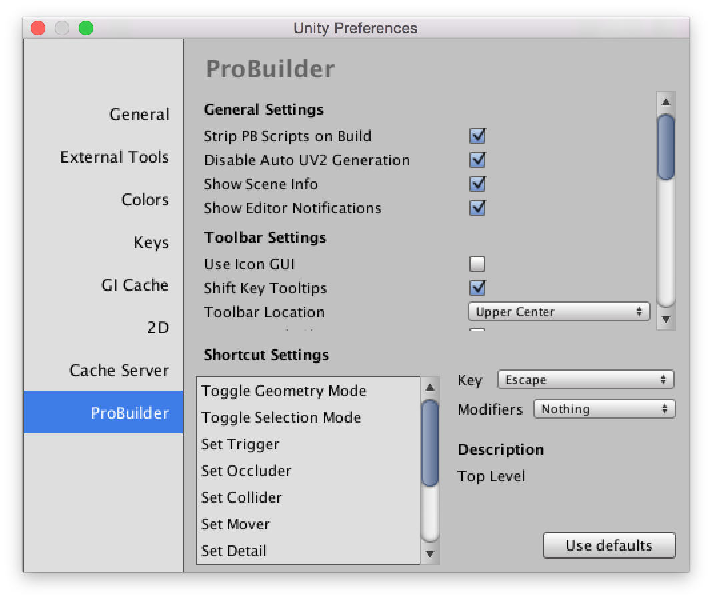

---

ProBuilder contains many settings that can be customized to suit your needs.

## General Settings

### Strip PB Scripts on Build

If enabled ProBuilder will automatically remove the extra data ProBuilder stores in a scene.  This includes all ProBuilder scripts, so if you are making use of the runtime API you will need to disable this feature.

### Disable Auto UV2 Generation

Generating a UV2 channel for meshes is necessary for lighting, but can be a time consuming operation.  If you are editing objects with large vertex counts it is beneficial to skip generating the UV2 channel after every geometry edit and do it manually (using the [Generate UV2](../toolbar/object-actions/#generateuv2) toolbar item).

### Show Scene Info

Show or hide the mesh information overlay in the top left of the Scene View.

### Show Editor Notifications

This preference enables or disables notification popups when performing actions.

## Toolbar Settings

### Use Icon GUI

Toggles the toolbar between using Icons or Text.

### Shift Key Tooltips

If enabled the ProBuilder toolbar will only show tooltips when the mouse is hovering an item and the `Shift` key is held.

By default tooltips are shown when the mouse hovers an action for more than a second.

### Toolbar Location

Controls where the [Element Mode Toolbar](../toolbar/overview-toolbar/#edit-mode-toolbar) is shown in the Scene View.

### Unique Mode Shortcuts

If Unique Mode Shorcuts is enabled ProBuilder assigns the `G, H, J, K` keys to `Object`, `Vertex`, `Edge`, and `Face` modes respectively.  You can change which keys are mapped to these actions in the Shortcut Settings section.

By default ProBuilder assigns the `G` key to toggle between `Object` mode and `Vertex/Edge/Face` modes.  `H` toggles between the different element modes `Vertex/Edge/Face`.

*More Info on Modes: [Object and Element Modes](../general/fundamentals/#modes);

### Open in Dockable Window

If enabled the ProBuilder toolbar will be opened as a dockable window.  If disabled the window will be floating and always on top.

## Resource Defaults

### Default Material

What material new shapes will be instantiated with.

### Default Entity

What [Entity Type](../toolbar/object-actions/#entity-type-tools) new shapes will be instantiated as.

### Default Collider

The type of collider new shapes will be instantiated with.

### Force Convex Mesh Collider

If the default collider is `Mesh Collider`, this setting controls the `Is Convex` setting of the collider.

## Miscellaneous Settings

### Limit Drag Check to Selection

When enabled ProBuilder will restrict drag selection of elements to the current selection.  If disabled drag selecting in a scene will test every ProBuilder object, which may be slow in larger scenes.

### Only PBO are Selectable

If enabled while ProBuilder is open only ProBuilder created GameObjects may be selected.

### Close Shape Window After Building

If enabled the [Shape Tool](../toolbar/tool-panels/#shape-tool) will automatically close itself after a new object is created.

### Dimension Overlay Lines

Hide or show the bounding lines in the Dimensions Overlay.

## Geometry Editing Settings

### Precise Element Selection

This controls how close to an element the cursor must be to register for selection.  By default this is disabled, meaning that vertex and edge selection are very forgiving when clicking.

If enabled, the selectable area for vertices and edges is smaller, but you may also select faces by clicking outside of vertices.

### Colors

ProBuilder allows users to set the colors for element selections.

<!--
### Selected Face Color
### Edge Wireframe Color
### Vertex Color
### Selected Vertex Color-->

### Vertex Handle Size

 Determines how large vertex points are rendered in the scene.  This setting does not affect selection.

### Force Pivot to Vertex Point

When instantiating new shapes ProBuilder will guarantee that the pivot point of the object coincides with a vertex position.

### Force Pivot to Grid

When instantiating a new object ProBuilder will snap the object to the nearest grid point (as determined by ProGrids).

### Bridge Perimeter Edges Only

When enabled ProBuilder will not allow users to bridge closed edges.  Disable to remove this restriction.

## Experimental

Warning! Enabling experimental features may break your project!  Please exercise caution.

### Meshes Are Assets

ProBuilder will store mesh information in the Project instead of per-scene.

## UV Editing Settings

### UV Snap Increment

Set the snap increment in the UV Editor window.

### Editor Window Floating

Make the UV Editor window floating or dock-able.
