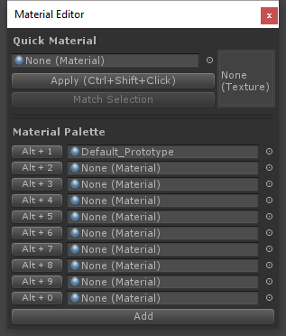

# Shape Tool

**Toolbar Icon:**  or 
 or 

**Keyboard Shortcut:** CTRL-SHIFT-K

**Purpose:** Create new editable shapes such as Cylinder, Arch, and Stairs.

Each shape has specific properties which can be customized before creation- for example, the Stairs shape lets you choose items like Step Height, Arc, and which parts of the Stairway to build.

**Usage:** To create a new shape, do the following:
 
1. Open the Shape Tool
1. If "Shape Preview" is enabled, you will see a blue Preview Object in the scene
1. Choose the Shape you'd like to create (ie, Cube, Cylinder, Torus, etc)
1. Set the options (ie, width, height, radius, number of stairs, etc)
1. You may Move or Rotate the Preview Object within your scene
1. Once ready, click "Build Shape" to create your final Shape

# Material Tools

**Toolbar Icon:**  or 
 or 

**Purpose:** Save frequently used materials, and quickly apply them to mesh faces or entire objects.

The Material Tools window also includes tools for picking a material from a selected mesh face, and "Find and Replace" functions. 

**"Quick Material" Usage:** : Use the Quick Material functions to 
 
1. Open the Shape Tool
1. If "Shape Preview" is enabled, you will see a blue Preview Object in the scene
1. Choose the Shape you'd like to create (ie, Cube, Cylinder, Torus, etc)
1. Set the options (ie, width, height, radius, number of stairs, etc)
1. You may Move or Rotate the Preview Object within your scene
1. Once ready, click "Build Shape" to create your final Shape

# UVEditor
@todo

# VertexColorEditor
@todo

# SmoothingEditor
@todo

# MirrorObjectsEditor
@todo

