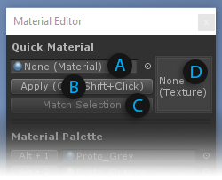
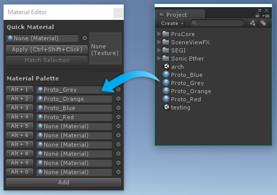
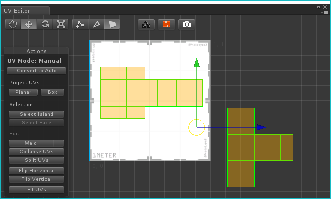
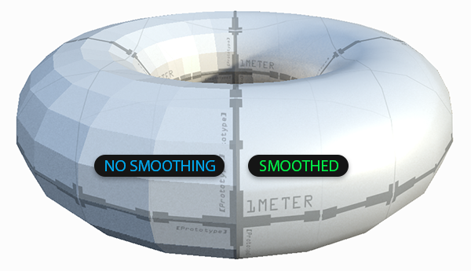
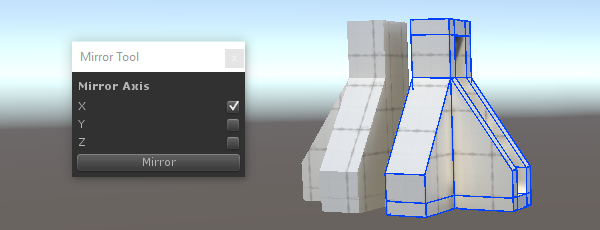

# New Shape Tool

**Toolbar Icon:**  ~ 
 ~ 

**Keyboard Shortcut:** CTRL-SHIFT-K

**Purpose:** Create new editable shapes such as Cylinder, Arch, and Stairs.

Each shape has specific properties which can be customized before creation- for example, the Stairs shape lets you choose items like Step Height, Arc, and which parts of the Stairway to build.

**Usage:** To create a new shape, do the following:
 
1. Open the New Shape Tool
1. If "Shape Preview" is enabled, you will see a blue Preview Object in the scene
1. Choose the Shape you'd like to create (ie, Cube, Cylinder, Torus, etc)
1. Set the options (ie, width, height, radius, number of stairs, etc)
1. You may Move or Rotate the Preview Object within your scene
1. Once ready, click "Build Shape" to create your final Shape

# Material Tools

**Toolbar Icon:**  ~ 
 ~ 

**Purpose:** Tools for getting materials from a face, setting materials with a single click, and saving frequently used materials for quick application.

See the "Applying Materials" section more information on applying materials to objects and faces.

**"Quick Material" Usage:** Use the Quick Material functions to get and set single materials quickly.

* (A) Drag-and-drop a material here to make it the "Quick Material" choice
* (B) Click here to apply the Quick Material to all selected faces
* (C) Click here to make the selected face's material your new Quick Material
* (D) A texture preview of the current Quick Material

You may also hold "CTRL and SHIFT" while clicking on a face, to apply the Quick Material to just that face.

**"Material Palette" Usage:** Use the Material Palette to store often-used materials, and apply them to faces or objects with quick keyboard shortcuts.

1. Open the Material Tools
1. Drag-and-drop materials to the Material Palette slots
1. To apply the material, click the button to it's left, or use it's shown keyboard shortcut

# UV Editor

**Toolbar Icon:**  ~ 
 ~ 
 
**Purpose:** Opens the UV Editor Panel for both simple Texturing control and more complex UV Editing.

See the "Texturing and UV Editing" section for full details. 

# Vertex Color Tools

**Toolbar Icon:** 
 ~ 
 
**Purpose:** Opens the Vertex Coloring controls, for applying or painting vertex colors onto meshes.

See the "Vertex Coloring" section for full details. 

# Smoothing Groups

**Toolbar Icon:**  ~ 
 ~ 

**Purpose:** Use Smoothing Groups to either smooth between adjacent faces or to force hard edges and corners.

# Mirror Tool

**Toolbar Icon:** 
 ~ 

**Purpose:** Use the Mirror Tool to create mirrored copies of objects.

The Mirror Tool is especially useful when creating symetrical items- build one half, mirror it, then weld the two together
for a perfectly symetrical result.

**Usage:**

1. Select the object to be mirrored
1. Open the Mirror Tools
1. Select which axis (or multiple axis) to mirror on
1. Click "Mirror"- a mirrored duplicate will be created

